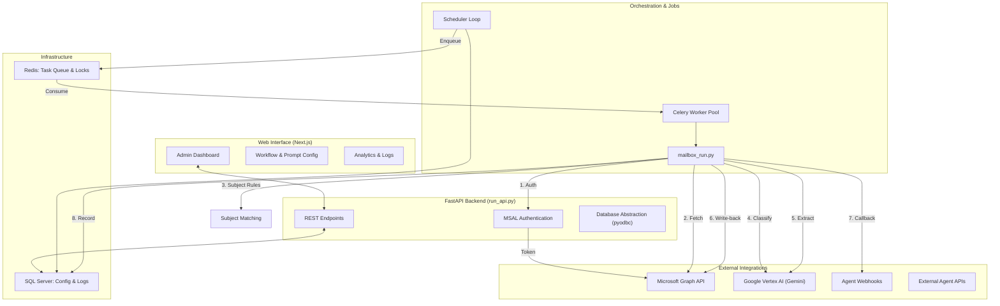

```mermaid
graph TD
    subgraph Frontend ["Web Interface (Next.js)"]
        UI[Admin Dashboard]
        Config[Workflow & Prompt Config]
        Stats[Analytics & Logs]
    end

    subgraph Backend ["FastAPI Backend (run_api.py)"]
        API[REST Endpoints]
        Auth[MSAL Authentication]
        DBA["Database Abstraction (pyodbc)"]
    end

    subgraph Persistence ["Infrastructure"]
        SQL["SQL Server: Config & Logs"]
        Redis["Redis: Task Queue & Locks"]
    end

    subgraph Execution ["Orchestration & Jobs"]
        Sched[Scheduler Loop]
        Worker[Celery Worker Pool]
        Pipeline[mailbox_run.py]
    end

    subgraph External ["External Integrations"]
        Graph[Microsoft Graph API]
        Gemini["Google Vertex AI (Gemini)"]
        Webhooks[Agent Webhooks]
        AgentAPIs[External Agent APIs]
    end

    %% Connections
    UI <--> API
    API <--> SQL
    Sched --> SQL
    Sched -- "Enqueue" --> Redis
    Redis -- "Consume" --> Worker
    Worker --> Pipeline

    %% Pipeline Flow
    Pipeline -- "1. Auth" --> Auth
    Auth -- "Token" --> Graph
    Pipeline -- "2. Fetch" --> Graph
    Pipeline -- "3. Subject Rules" --> Subj[Subject Matching]
    Pipeline -- "4. Classify" --> Gemini
    Pipeline -- "5. Extract" --> Gemini
    Pipeline -- "6. Write-back" --> Graph
    Pipeline -- "7. Callback" --> Webhooks
    Pipeline -- "8. Record" --> SQL
```