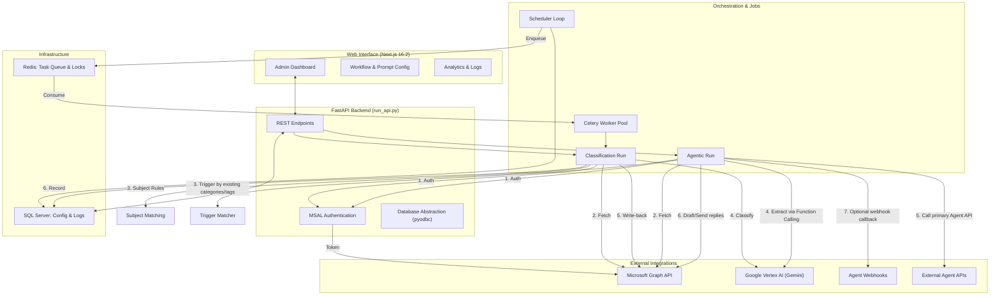

```mermaid
graph TD
    subgraph Frontend ["Web Interface (Next.js 16.2)"]
        UI[Admin Dashboard]
        Config[Workflow & Prompt Config]
        Stats[Analytics & Logs]
    end

    subgraph Backend ["FastAPI Backend (run_api.py)"]
        API[REST Endpoints]
        Auth[MSAL Authentication]
        DBA["Database Abstraction (pyodbc)"]
    end

    subgraph Persistence ["Infrastructure"]
        SQL["SQL Server: Config & Logs"]
        Redis["Redis: Task Queue & Locks"]
    end

    subgraph Execution ["Orchestration & Jobs"]
        Sched[Scheduler Loop]
        Worker[Celery Worker Pool]
        ClassifyPipeline[Classification Run]
        AgenticPipeline[Agentic Run]
    end

    subgraph External ["External Integrations"]
        Graph[Microsoft Graph API]
        Gemini["Google Vertex AI (Gemini)"]
        Webhooks[Agent Webhooks]
        AgentAPIs[External Agent APIs]
    end

    %% Connections
    UI <--> API
    API <--> SQL
    Sched --> SQL
    Sched -- "Enqueue" --> Redis
    Redis -- "Consume" --> Worker
    Worker --> ClassifyPipeline
    API --> ClassifyPipeline
    API --> AgenticPipeline

    %% Classification Flow
    ClassifyPipeline -- "1. Auth" --> Auth
    Auth -- "Token" --> Graph
    ClassifyPipeline -- "2. Fetch" --> Graph
    ClassifyPipeline -- "3. Subject Rules" --> Subj[Subject Matching]
    ClassifyPipeline -- "4. Classify" --> Gemini
    ClassifyPipeline -- "5. Write-back" --> Graph
    ClassifyPipeline -- "6. Record" --> SQL

    %% Agentic Flow (independent)
    AgenticPipeline -- "1. Auth" --> Auth
    AgenticPipeline -- "2. Fetch" --> Graph
    AgenticPipeline -- "3. Trigger by existing categories/tags" --> Trigger[Trigger Matcher]
    AgenticPipeline -- "4. Extract via Function Calling" --> Gemini
    AgenticPipeline -- "5. Call primary Agent API" --> AgentAPIs
    AgenticPipeline -- "6. Draft/Send replies" --> Graph
    AgenticPipeline -- "7. Optional webhook callback" --> Webhooks
```
